# خطة تدفق بيانات العناصر النائبة (Placeholder Data Lookup Flow)

## نظرة عامة

تنفيذ ترتيب بحث صارم للعناصر النائبة:
1) جدول السفن (vessels)
2) جداول قاعدة البيانات الأخرى (الموانئ، الشركات، المصافي - بدون الوسطاء brokers) عبر المفاتيح الأجنبية للسفينة
3) ملفات CSV (المشتري، البائع)
4) بيانات عشوائية واقعية مُولّدة بالذكاء الاصطناعي

**جدول الوسطاء (brokers) مستبعد من الربط والاستبدال.**

---

## الوضع الحالي

- **عند الرفع**: يحلل الذكاء الاصطناعي العناصر النائبة ويربطها بقاعدة البيانات (جدول.عمود) أو CSV أو عشوائي، ويحفظها في `template_placeholders`.
- **عند التوليد**: يستخدم إعدادات CMS؛ وعندما يكون المصدر قاعدة البيانات، يجلب من الجدول المُعدّ. الدالة `_intelligent_field_match` تبحث فقط في قاموس **السفن**.
- **الفجوة**: المطابقة الذكية لا تجرب الموانئ والشركات والمصافي. (جدول الوسطاء مستبعد حسب طلب المستخدم.) التتابع يستخدم فقط CSV المُعدّ في CMS، وليس بحثاً عاماً في CSV.

---

## التدفق المستهدف (متطلبات المستخدم)

```mermaid
flowchart TD
    subgraph upload [عند الرفع]
        A[استخراج العناصر النائبة من DOCX]
        B[الذكاء الاصطناعي يحلل كل عنصر]
        C1[التحقق من أعمدة جدول السفن]
        C2[التحقق من الموانئ والشركات والمصافي - بدون وسطاء]
        C3[التحقق من أعمدة CSV - المشتري والبائع]
        C4[ربط بعشوائي - ذكاء اصطناعي واقعي]
        B --> C1
        C1 -->|تطابق| MapDB[حفظ ربط قاعدة البيانات]
        C1 -->|لا تطابق| C2
        C2 -->|تطابق| MapDB
        C2 -->|لا تطابق| C3
        C3 -->|تطابق| MapCSV[حفظ ربط CSV]
        C3 -->|لا تطابق| C4
        C4 --> MapRandom[حفظ عشوائي]
    end

    subgraph gen [عند توليد المستند]
        G[لكل عنصر نائب]
        D1[البحث في جدول السفن]
        D2[البحث في الموانئ عبر ميناء المغادرة والوصول]
        D3[البحث في الشركات والمصافي عبر مفاتيح السفينة - بدون وسطاء]
        D4[البحث في CSV - المشتري والبائع]
        D5[الذكاء الاصطناعي يولّد بيانات عشوائية واقعية]
        G --> D1
        D1 -->|موجود| Use[استخدام القيمة]
        D1 -->|غير موجود| D2
        D2 -->|موجود| Use
        D2 -->|غير موجود| D3
        D3 -->|موجود| Use
        D3 -->|غير موجود| D4
        D4 -->|موجود| Use
        D4 -->|غير موجود| D5
        D5 --> Use
    end
```



---

## 1. توسيع `_intelligent_field_match` للبحث في كل الجداول

**الملف**: `document-processor/main.py`

**الحالي**: `_intelligent_field_match(placeholder, vessel)` تبحث فقط في قاموس `vessel`.

**التغيير**: إنشاء `_intelligent_field_match_multi_table(placeholder, vessel, supabase)` تقوم بـ:

1. **الخطوة 1 - السفن**: البحث في قاموس السفن (المنطق الحالي: مطابقة الذكاء الاصطناعي، الربط المباشر، المرادفات، التشابه).
2. **الخطوة 2 - إن لم يُعثر**: بناء قاموس بيانات مرتبطة بجلب:
  - **الموانئ**: `get_data_from_table('ports', ...)` لميناء المغادرة والوصول.
  - **الشركات**: `get_data_from_table('companies', ...)`.
  - **المصافي**: `get_data_from_table('refineries', ...)`.
  - **(جدول الوسطاء مستبعد)**
3. **الخطوة 3**: تشغيل نفس منطق المطابقة على القاموس المدمج. تفضيل السفن أولاً، ثم الجداول المرتبطة.
4. إرجاع `(field_name, value)` أو `(None, None)`.

---

## 2. إضافة بحث CSV ذكي في التتابع

**الملف**: `document-processor/main.py`

**التغيير**: إضافة `_smart_csv_search(placeholder)` التي:
- تتكرر على كل ملفات CSV من `list_csv_datasets()`.
- لكل CSV، تحمّل الأعمدة.
- تطبّع اسم العنصر النائب إلى شكل عمود (مثل "BUYER_NAME" → "buyer_name").
- تجد أفضل عمود مطابق.
- تُرجع القيمة من الصف الأول المطابق، أو None.

**التكامل**: عند عودة `_try_csv_for_placeholder(setting)` بقيمة None، استدعاء `_smart_csv_search(placeholder)` قبل الانتقال إلى `generate_realistic_data_ai`.

---

## 3. تقوية موجه الذكاء الاصطناعي عند الرفع

**الموقع**: موجه `_ai_analyze_and_map_placeholders` (حوالي السطر 1482).

**التغيير**: جعل ترتيب الأولوية واضحاً:

```
**ترتيب البحث (اتّبعه بدقة):**
1. **السفن أولاً**: رقم IMO، اسم السفينة، العلم، المالك، الأبعاد، الشحن، الميناء، إلخ -> جدول vessels.
2. **جداول أخرى**: أسماء الموانئ، الشركات، المصافي -> جداول ports, companies, refineries. (لا تستخدم جدول brokers.)
3. **CSV**: المشتري/البائع/جهة الاتصال -> csv مع عمود مطابق.
4. **عشوائي**: فقط عندما لا يناسب أي عمود في قاعدة البيانات أو CSV. سنولّد بيانات واقعية بالذكاء الاصطناعي وقت التشغيل.
```

**استبعاد جدول الوسطاء**:
- في `_build_schema_for_mapping`، تغيير القائمة إلى `tables = ['vessels', 'ports', 'refineries', 'companies']` (إزالة 'brokers').
- في حلقة التوليد، عند `database_table == 'brokers'`، تجاوز بحث قاعدة البيانات والانتقال للتتابع (CSV ثم الذكاء الاصطناعي).

---

## 4. التأكد من استخدام الذكاء الاصطناعي العشوائي لسياق العنصر النائب

**التعزيز**: في `generate_realistic_data_ai`، توسيع الموجه ليشمل دلالة العنصر النائب:
- "العنصر النائب '{placeholder}' يوحي بـ: [استنتاج من الكلمات: تاريخ، بريد، شركة، ميناء، كمية، إلخ]. ولّد قيمة بحرية/نفطية واقعية لهذا النوع."

---

## 5. العناصر النائبة غير المطابقة: التتابع الكامل

**التغيير**: التأكد من أن التتابع للعناصر **غير المطابقة** (بدون إعداد CMS) هو:

1. `_intelligent_field_match_multi_table` (السفن -> الموانئ -> الشركات -> المصافي؛ بدون وسطاء).
2. `_smart_csv_search(placeholder)`.
3. `generate_realistic_data_ai(placeholder, vessel, vessel_imo)`.

للعناصر **ذات** إعداد CMS التي تفشل: نفس ترتيب التتابع، مع تجربة CSV المُعدّ في CMS أولاً عبر `_try_csv_for_placeholder`، ثم `_smart_csv_search`، ثم الذكاء الاصطناعي.

---

## 6. ملخص تغييرات الكود

| المكوّن | التغيير |
|---------|---------|
| `_intelligent_field_match` | استبدال/توسيع بدالة `_intelligent_field_match_multi_table` تبحث في السفن ثم الموانئ والشركات والمصافي (بدون وسطاء). |
| كتلة التتابع | إضافة استدعاء `_smart_csv_search(placeholder)` عند عودة CSV من الإعداد بقيمة None؛ قبل الذكاء الاصطناعي. |
| `_ai_analyze_and_map_placeholders` | تقوية الموجه بترتيب بحث من 4 خطوات. |
| `generate_realistic_data_ai` | اختياري: تحسين الموجه لاستنتاج نوع العنصر النائب من الاسم. |

---

## 7. الاختبار

- رفع قالب بعناصر نائبة مثل `{Vessel Name}`, `{Loading Port}`, `{Buyer Company}`, `{Custom Field}`.
- التحقق: بيانات السفينة/الميناء/الشركة من قاعدة البيانات؛ المشتري من CSV؛ المخصص من الذكاء الاصطناعي.
- توليد المستند والتحقق من أن القيم واقعية ومن المصادر الصحيحة.
